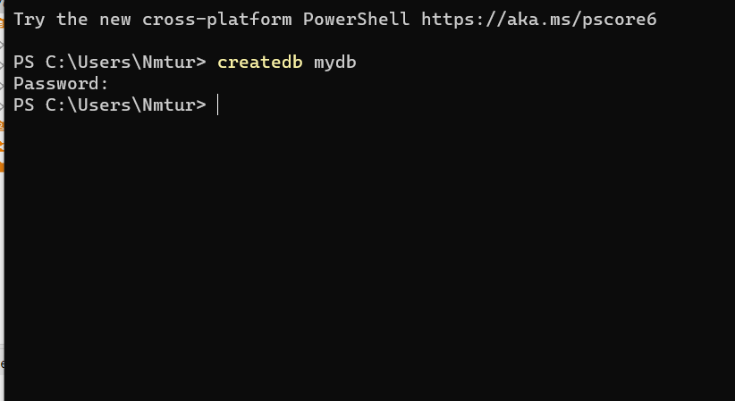
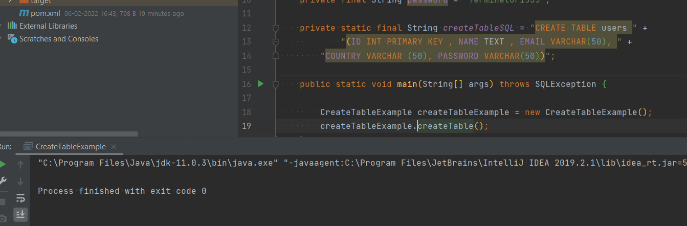
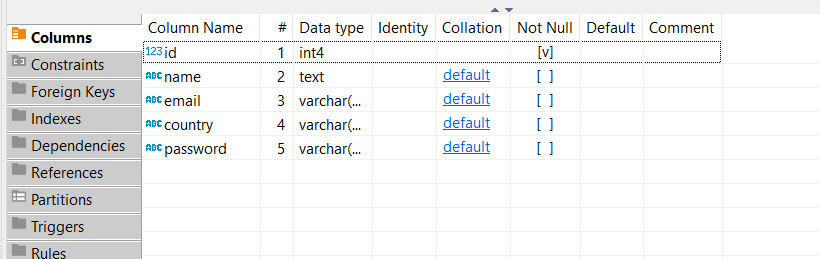
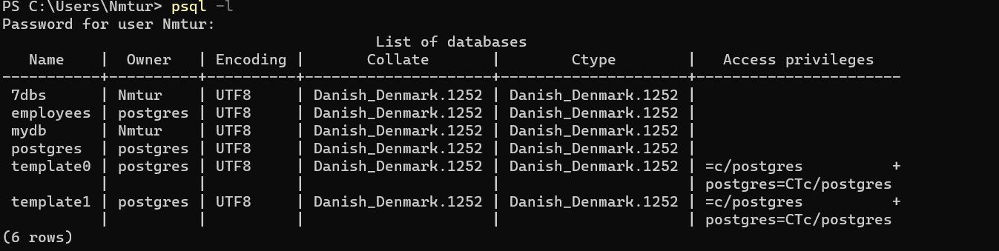
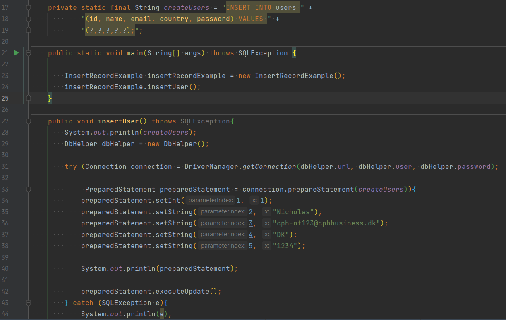
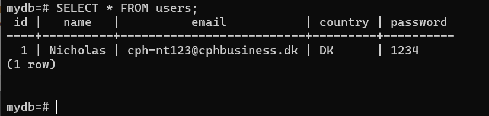
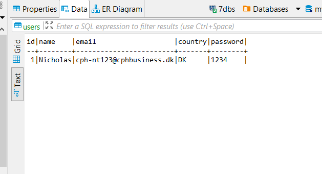
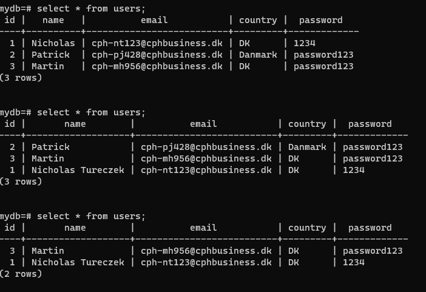
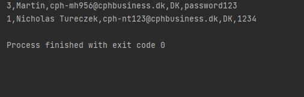

To connect to the database you need to create a .env file at the root. in this file you have to fill out
with your own credentials. this is done to retain some sort of security. 

    psqlUrl = 
    psqlUser = 
    psqlPassword = 

Creating "mydb"

running first create table script.

Table created

Also seen in the terminal.

Created a user.
As can be seen, the use of "?" in the VALUES section is to prevent SQL injections.

As shown in terminal:

And in Dbeaver:

After implementing the CRUD, all the functions are working. 

As can be seen in the image above, we can get all users, update a user, and delete a user.
It is also made possible to get the users presented directly in the IDE.

I know that there is an easier way of making a crud system by using JDBC, but this is an example to demonstrate the 
work that the JDBC driver does for us.

All of this is being done locally on the system, but could also be done by using docker.
The advantage of using docker is that you don't need to have the program installed on your computer.
When using docker you create a virtual environment -A container- which can be used to run postgresql.

To do this, the following commands can be run:

    docker run --name postgres-db -e POSTGRES_PASSWORD=docker -p 5432:5432 -d postgres

Then the file should be containerized and build by typing:

    docker build -t my-postgres-db ./

We have now called our image "my-postgres-db".

then we can run it by typing:

    docker run -d --name my-postgresdb-container -p 5432:5432 my-postgres-db

To use docker is a great way to ensure version control both when working in db environments and programming environments.

